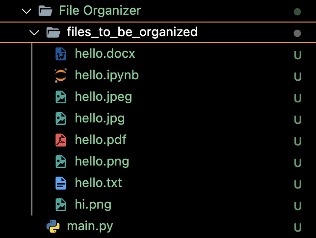
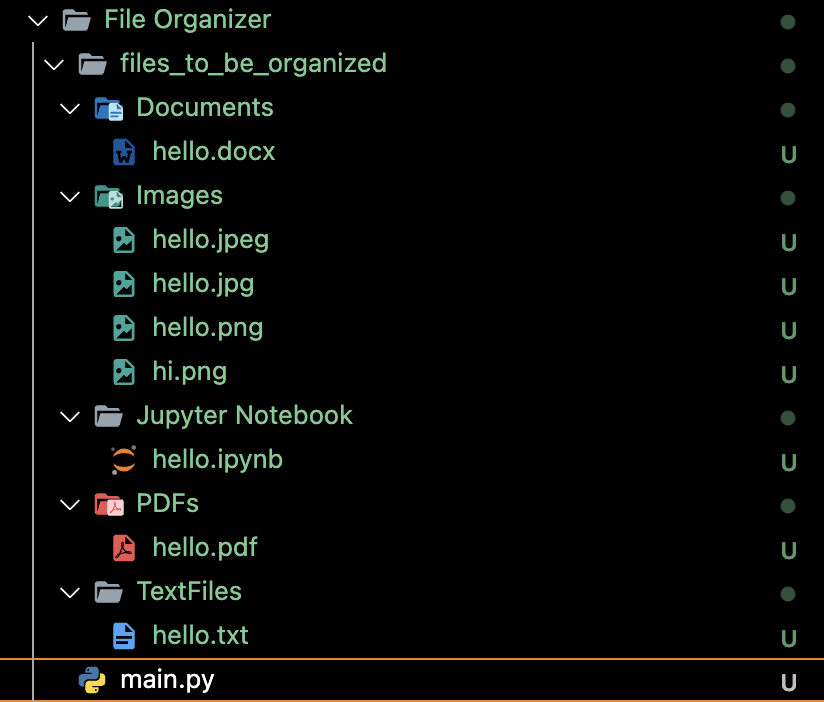

# File Organizer

The File Organizer is a Python script that automates the task of organizing files within a specified directory based on their file extensions. This project aims to improve file management efficiency by categorizing files into designated folders according to their file types.

## Features

- **File Extension Detection:** The script identifies the file extensions of all files within the specified directory.
- **File Categorization:** Files are categorized into destination folders based on their file extensions.
- **Folder Creation:** Destination folders are created automatically if they do not exist.
- **File Movement:** Files are moved from the original directory to their respective destination folders.
- **Logging:** Optional logging feature records the actions performed by the script.

## Getting Started

### Prerequisites

- Python 3.x installed on your system.

### Installation

1. Clone this repository:

   ```bash
   git clone https://github.com/sahilsapariya/All-about-Python.git
   ```

2. Navigate to the project directory:

   ```bash
   cd './10 mini projects/File Organizer/'
   ```

### Usage

1. Run the script `main.py` with the source directory path as an argument:

   ```bash
   python main.py ./files_to_be_organized
   ```

   Replace `./files_to_be_organized` with the path to the directory containing the files you want to organize.

2. The script will organize the files within the specified directory based on their file extensions.

### Before running script



### After running script



### In the console

```
Moved 'hi.png' to 'Images' folder.
Moved 'hello.ipynb' to 'Jupyter Notebook' folder.
Moved 'hello.jpg' to 'Images' folder.
Moved 'hello.png' to 'Images' folder.
Moved 'hello.pdf' to 'PDFs' folder.
Moved 'hello.jpeg' to 'Images' folder.
Moved 'hello.txt' to 'TextFiles' folder.
Moved 'hello.docx' to 'Documents' folder.
```


## Contributing

Contributions are welcome! If you find any issues or have suggestions for improvements, please open an issue or submit a pull request.


Feel free to customize this README file according to your project's specific details and requirements.
